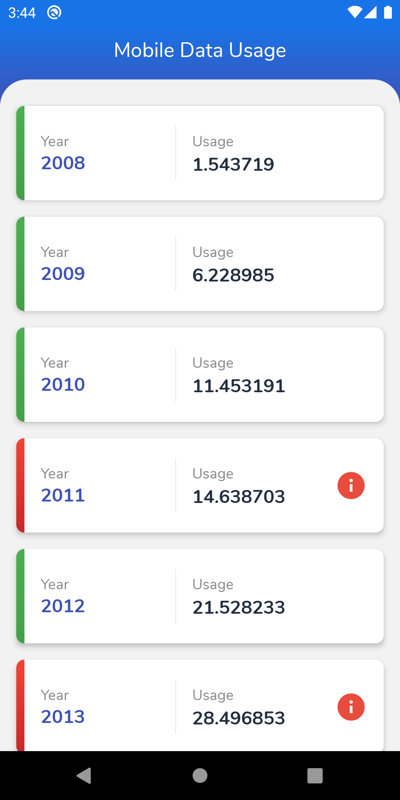
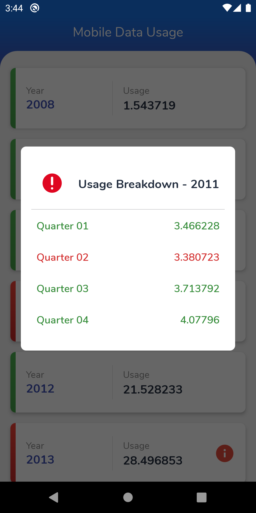
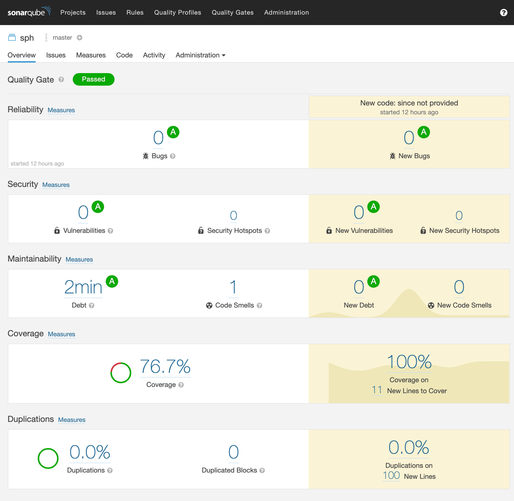

# SPH

This application developed using Kotlin and consumes Api from Data.gov.sg to retrieve a list of mobile data usage which summarize the amount the of data sent over Singapore’s mobile networks from 2008 to 2018.

## Completed Tasks:
 - Task ONE: Display a list of data
 - Task TWO: Display a clickable image
 - Task THREE: Data Caching (Using Room)

- Non-emulator Test: Completed
- Emulator test: Completed
- Code Coverage : 76.7%

## Screenshots
Home Screen                |  Yearly Breakdown                     
:-------------------------:|:-------------------------:
  |  

## Code Coverage (76.7%):

## Architecture:

## Technologies:
- Android Architecure: [MVVM](https://developer.android.com/jetpack/docs/guide#overview)
- Binding UI Component: [DataBinding](https://developer.android.com/topic/libraries/data-binding/)
- Observe Data Holder: [Live Data](https://developer.android.com/topic/libraries/architecture/livedata)
- Network: [Retrofit](https://square.github.io/retrofit/) with RxJava/RxAndroid
- Offline Caching: [Room](https://developer.android.com/topic/libraries/architecture/room)
- Dependancy Injection: [Dagger2](https://dagger.dev/)
- Store UI Releated Data: [ViewModel](https://developer.android.com/topic/libraries/architecture/viewmodel)
- Animation: [Lottie](https://airbnb.design/lottie/)
- Followed [Material Design](https://material.io/design) Pattern
- Used AndroidX with [Android JetPack](https://developer.android.com/jetpack) Components
- Unit Test: [JUnit](https://junit.org/junit4/), [Mockito](https://site.mockito.org/) and [Robolectric](http://robolectric.org/)
- UI Test: [Espresso](https://developer.android.com/training/testing/espresso)
